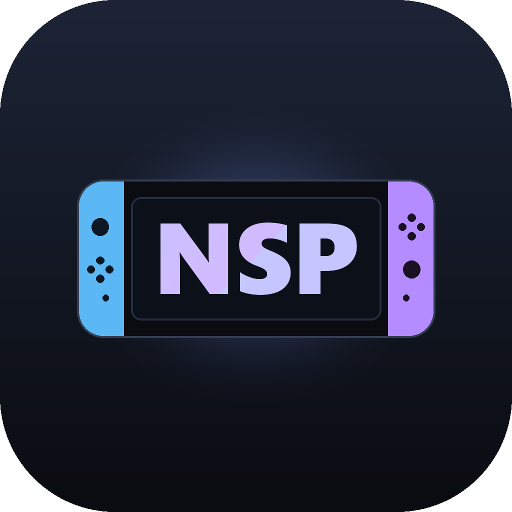
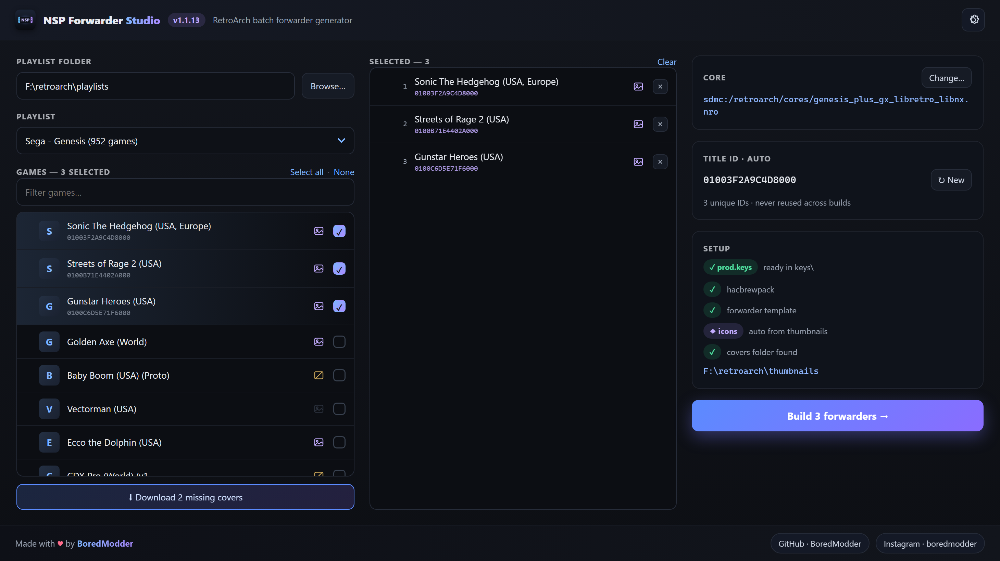
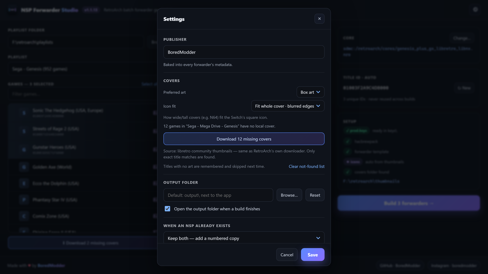
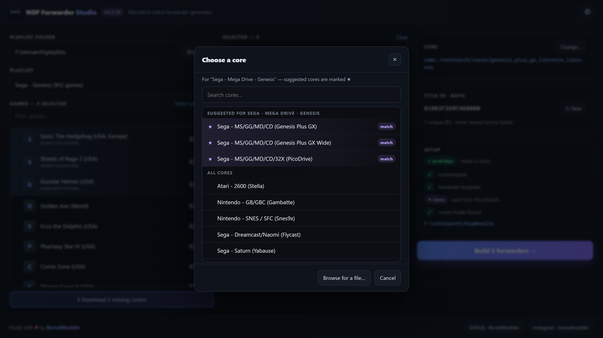

# NSP RetroArch Batch Forwarder

**Turn your RetroArch playlists into Nintendo Switch forwarder NSPs — in bulk.**

Made with ♥ by [**BoredModder**](https://github.com/BoredModder) · [@boredmodder](https://www.instagram.com/boredmodder/)

---

Point it at your RetroArch `\playlists` folder, tick the games you want, and it builds a launchable **NSP forwarder** for each one — with box art pulled straight from your RetroArch thumbnails and a fresh, never-reused Title ID. Launch a game from the Switch home menu and it boots directly in RetroArch.

Everything the build needs (`hacbrewpack` + the forwarder template) is **bundled inside the app**. The only thing you provide is your own `prod.keys`.

## Features

- **Batch builds** — multi-select any number of games from a playlist and build them all at once, with a live **Selected** panel and progress.
- **Reads RetroArch playlists (`.lpl`)** — the core, ROM path and title all come from the playlist automatically.
- **Automatic box art** — matches each game to your RetroArch thumbnails and renders a crisp 256×256 icon, with a fallback when none is found.
- **See what has art at a glance** — every game is tagged: 🟪 cover found · ⬜ no cover yet · 🟨 not available on the server.
- **Download missing covers** — one click grabs box art from the libretro thumbnail server (the same source RetroArch uses) straight into the right `thumbnails` folder. Downloads run in parallel, and titles with no art are remembered so they're not retried.
- **Smart core picker** — cores are listed by console (*"Sega - Dreamcast/Naomi (Flycast)"*), and the ones that match your playlist's system are **starred and shown first** — no more guessing which `.nro` is which.
- **Icon fit for any shape** — wide/tall covers (e.g. N64) fit the Switch's square icon cleanly: fit-whole-cover with a blurred backdrop, dark bars, or crop-to-fill.
- **Auto Title IDs** — a valid homebrew-range Title ID per game, remembered so it's never reused across builds.
- **Settings that stick** — publisher name, preferred art type, output folder (with optional auto-open), and what to do when an NSP already exists (keep both / overwrite / skip).
- **Clean names** — region/language tags are stripped, so *"Baseball Stars (Japan, Europe) (En,Ja)"* becomes **Baseball Stars** on your home menu.
- **Self-contained** — one `.exe`, no install, no Python. Just add your keys.

Settings — covers, icon fit, output folder, and build behaviour

  

Smart core picker — the right cores for your playlist, starred and on top

## Download & install

1. Download **`NSP Forwarder Studio.exe`** from the latest **[Release](../../releases/latest)** and drop it in its own folder.
2. Run it once — it creates `keys` and `output` folders next to itself.
3. Put your Switch `prod.keys` in the `keys` folder — or click **Locate prod.keys…** in the app.
4. **Browse** to your RetroArch `\playlists` folder → pick a playlist → tick games → **Build**.
5. Finished `.nsp` files appear in the `output` folder. Copy them to your Switch and install with your NSP installer (DBI, Tinfoil, …). Launch from the Home menu.

> Windows may show a SmartScreen warning because the app is unsigned — click **More info → Run anyway**.

## Requirements

- Windows 10 / 11
- A Nintendo Switch running custom firmware (Atmosphère) with RetroArch installed
- Your own `prod.keys` (personal to your console — **never** distributed with this app)

## Credits & acknowledgements

- Built by **BoredModder**.
- Packing by [**hacBrewPack**](https://github.com/The-4n/hacBrewPack) (GPL-2.0).
- Forwarder based on the open-source **nx-hbloader** forwarder.
- Box art from the community [libretro thumbnails](https://thumbnails.libretro.com/) project.
- Not affiliated with Nintendo. For use with your own legally-owned games.
