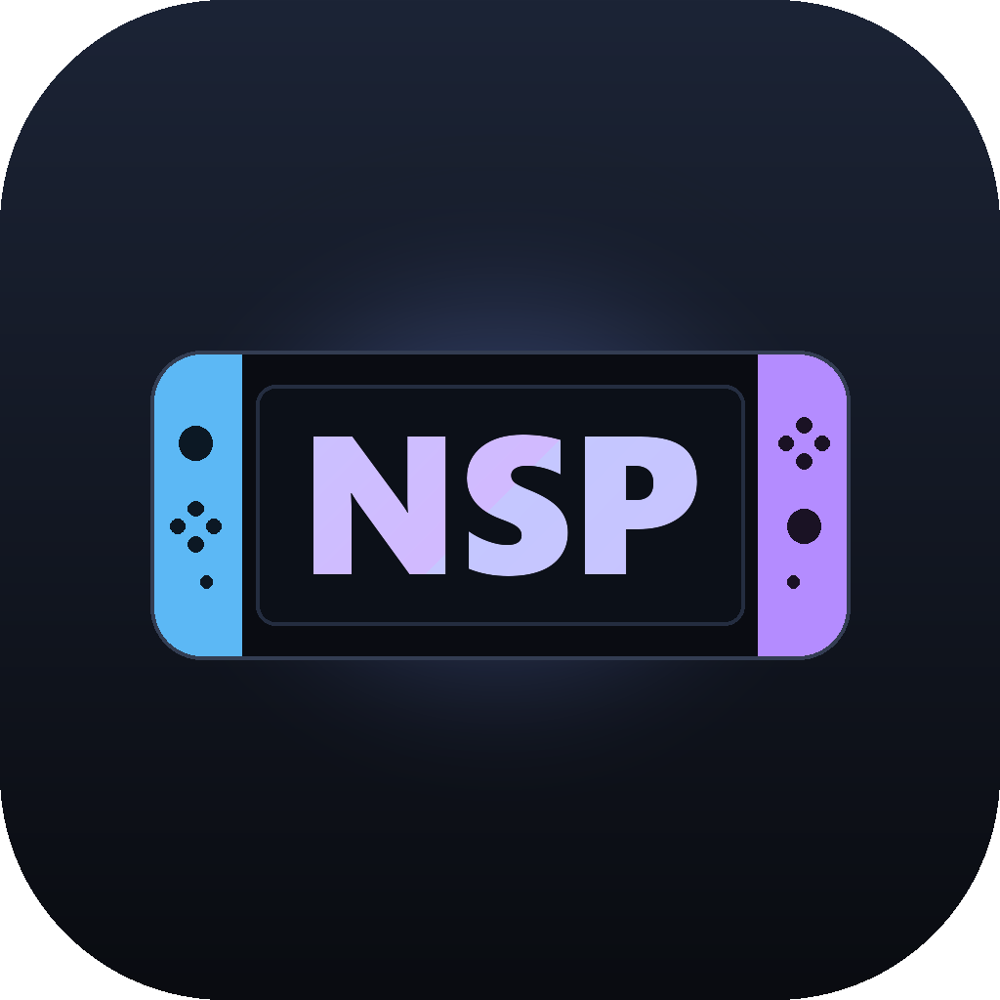
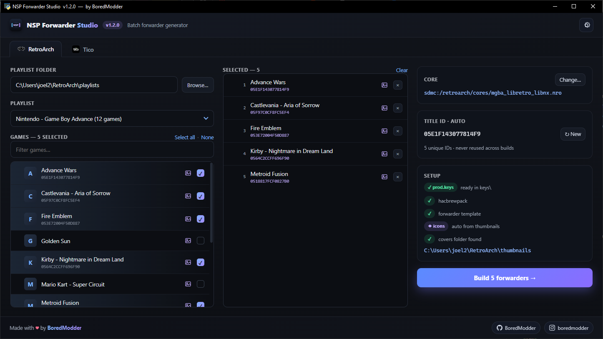
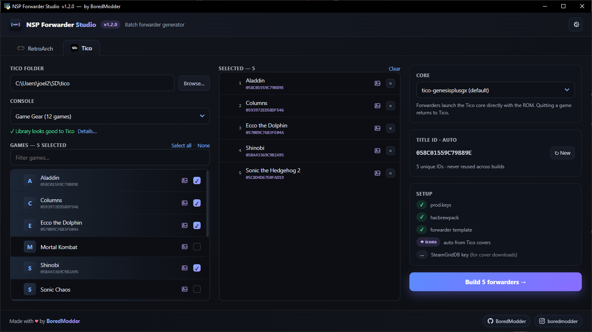
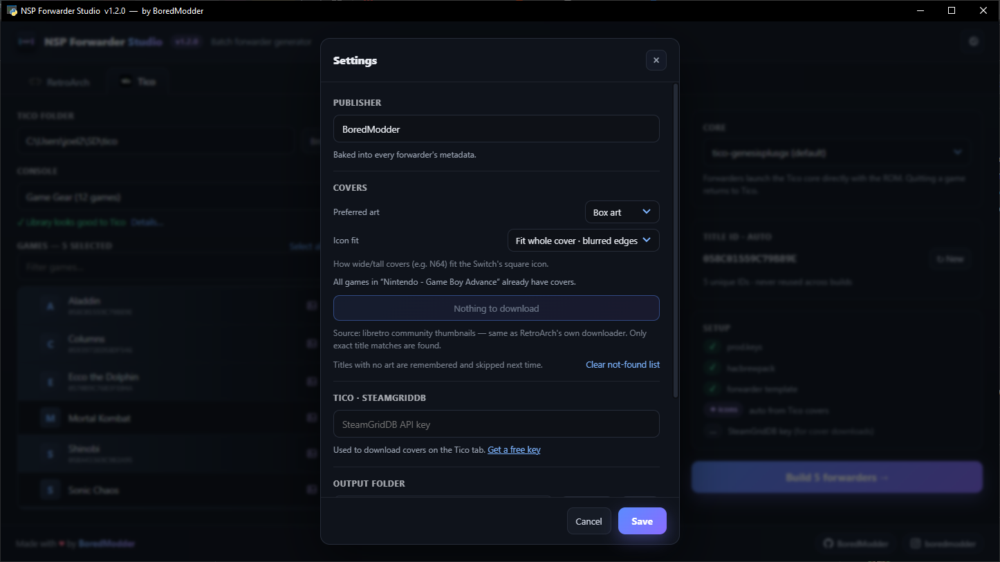

# NSP Batch Forwarder

**Turn your RetroArch playlists and Tico library into Nintendo Switch forwarder NSPs — in bulk.**

Made with ♥ by [**BoredModder**](https://github.com/BoredModder) · [@boredmodder](https://www.instagram.com/boredmodder/)

---

Point it at your RetroArch `\playlists` folder **or** your SD card's `\tico` folder, tick the games you want, and it builds a launchable **NSP forwarder** for each one — with box art matched automatically and a fresh, never-reused Title ID. Launch a game from the Switch home menu and it boots straight into RetroArch or Tico.

Everything the build needs (`hacbrewpack` + the forwarder template) is **bundled inside the app**. The only thing you provide is your own `prod.keys`.

## Features

- **Two frontends, one app** — build forwarders for **RetroArch** (from your `.lpl` playlists) or **Tico** (from your SD card's `tico` library), each in its own tab.
- **Batch builds** — multi-select any number of games and build them all at once, with a live **Selected** panel and progress.
- **Reads RetroArch playlists (`.lpl`)** — the core, ROM path and title all come from the playlist automatically.
- **Automatic box art** — matches each game to your RetroArch thumbnails (RetroArch tab) or downloads Tico covers from **SteamGridDB** (Tico tab), rendered to a crisp icon with a fallback when none is found.
- **See what has art at a glance** — every game is tagged: 🟪 cover found · ⬜ no cover yet · 🟨 not available on the server.
- **Download missing covers** — one click grabs box art (libretro thumbnails for RetroArch, SteamGridDB for Tico) straight into the right folder. Downloads run in parallel, and titles with no art are remembered so they're not retried.
- **Smart core picker** — RetroArch cores are listed by console and the ones matching your playlist are **starred and shown first**; Tico forwarders launch the console's Tico core directly and return to Tico on quit.
- **Tico library check** — validates your Tico SD layout (folder structure, cover sizes, per-console quirks) and can auto-fix the safe issues before you build.
- **Icon fit for any shape** — wide/tall covers (e.g. N64) fit the Switch's square icon cleanly: fit-whole-cover with a blurred backdrop, dark bars, or crop-to-fill.
- **Auto Title IDs** — a valid homebrew-range Title ID per game, remembered so it's never reused across builds.
- **Settings that stick** — publisher name, preferred art type, output folder (with optional auto-open), and what to do when an NSP already exists (keep both / overwrite / skip).
- **Clean names** — region/language tags are stripped, so *"Baseball Stars (Japan, Europe) (En,Ja)"* becomes **Baseball Stars** on your home menu.
- **Self-contained** — no install, no Python; everything's bundled. Just add your keys.

Tico tab — pick a console, tick games, build. Covers via SteamGridDB, with a built-in library check.

  

Settings — covers, icon fit, SteamGridDB key, output folder, and build behaviour

## Download & install

1. Download the latest **[Release](../../releases/latest)** `.zip` and unzip it anywhere.
2. Open the extracted **`NSP Forwarder Studio`** folder and run **`NSP Forwarder Studio.exe`** (keep it next to its `_internal` folder).
3. Put your Switch `prod.keys` in the `keys` folder — or click **Locate prod.keys…** in the app.
4. **RetroArch:** browse to your `\playlists` folder → pick a playlist → tick games → **Build**.
   **Tico:** switch to the Tico tab → point it at your SD card's `\tico` folder → pick a console → tick games → **Build**.
5. Finished `.nsp` files appear in the `output` folder. Copy them to your Switch and install with your NSP installer (DBI, Tinfoil, …). Launch from the Home menu.

> Windows may show a SmartScreen warning because the app is unsigned — click **More info → Run anyway**.

## ⚠️ Antivirus false positive

Some antivirus products (Windows Defender, Bitdefender, and a few others) may flag this app as a virus. **It is a false positive.**

The app is built with [PyInstaller](https://pyinstaller.org/), which packages Python into a Windows `.exe`. Because a lot of malware is also built this way, some antivirus engines flag *any* PyInstaller app on sight — even when it's completely safe. The detections are all generic "machine-learning"/heuristic guesses (e.g. Microsoft's `Wacatac.B!ml`), not identifications of any real threat: on [VirusTotal](https://www.virustotal.com/gui/file/32561934cf6d5b57499c24e9fc66aec53760589ee805188da373e7c34f6a9f9f) only 12 of 70 engines flag it, and every serious signature-based engine (Kaspersky, ESET, Sophos, Symantec, …) reports it clean.

**This project is fully open source** — you can read every line at [NSP-Forwarder-Studio-src](https://github.com/BoredModder/NSP-Forwarder-Studio-src) and build it yourself if you prefer.

If your antivirus quarantines it, you can safely restore it / add an exclusion. The false positive has also been reported to the antivirus vendors.

## Requirements

- Windows 10 / 11
- A Nintendo Switch running custom firmware (Atmosphère) with **RetroArch and/or Tico** installed
- Your own `prod.keys` (personal to your console — **never** distributed with this app)

## Credits & acknowledgements

- Built by **BoredModder**.
- Packing by [**hacBrewPack**](https://github.com/The-4n/hacBrewPack) (GPL-2.0).
- Forwarder based on the open-source **nx-hbloader** forwarder.
- RetroArch box art from the community [libretro thumbnails](https://thumbnails.libretro.com/) project.
- Tico box art from [**SteamGridDB**](https://www.steamgriddb.com/).
- Not affiliated with Nintendo. For use with your own legally-owned games.
